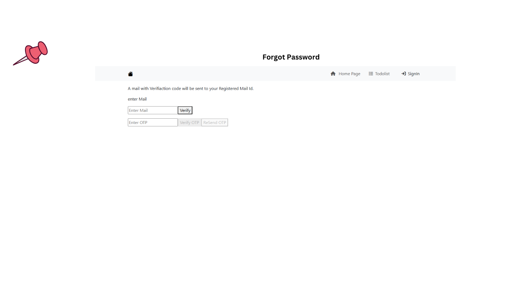

## Project Details
<ul>
<li><label>Description</label>  

<b>ToDo</b> List is a Project to create,Read,Upgrade,Delete <b>*Notes</b> and <b>*Users</b> 

</li>
<li><label>Software</label>  

<b>Frontend </b>: Angular 16 
 
<b>Backend </b>: ASP.NET EntityFrameworkCore & MS SQL server management Studio 20 
 
</li>
<li><label>Database(mySql)</label>  

<b>Tables </b>: Users , Notes

</li>
</ul>

## Setup and Working Video

## To-Do List

<h3>Steps</h3><ol>
  
<li><b>Download</b> the Project Zip from the option provided by GitHub Platform</li>
<li><b>Open The SampleApi</b> ASP.net Project in Microsoft Visual Studio (if you don't have,Install it from Microsoft Wesbite) https://visualstudio.microsoft.com </li>
<li>Go with all the basic Configuration and Installation</li>
<li>Open the <b>SampleProject2</b> folder in any Software Dev Kit (Visual Code Preferable ) and install <b>Angular</b> Extentions if available.
</li>
<li>Run <b>npm install </b></li>
<li>Use "ng" command to run project -> <b>ng serve </b></li>
<li>Make sure to run Api before running Angular Project to <b>fetch all data from API</b></li>
<li>After web server has set <b>run</b> and <b>Create an Account and create ToDo's</b></li>
</ol>

(Note) : if any problems caused please verify the Configurations and mainly Angular version <b>v16</b> and it's Compatible libraries.

(P.S-if there are any problems,i would be glad if you Review.)

<h3>ScreenShots</h3>

.png)

.png)
.png)

